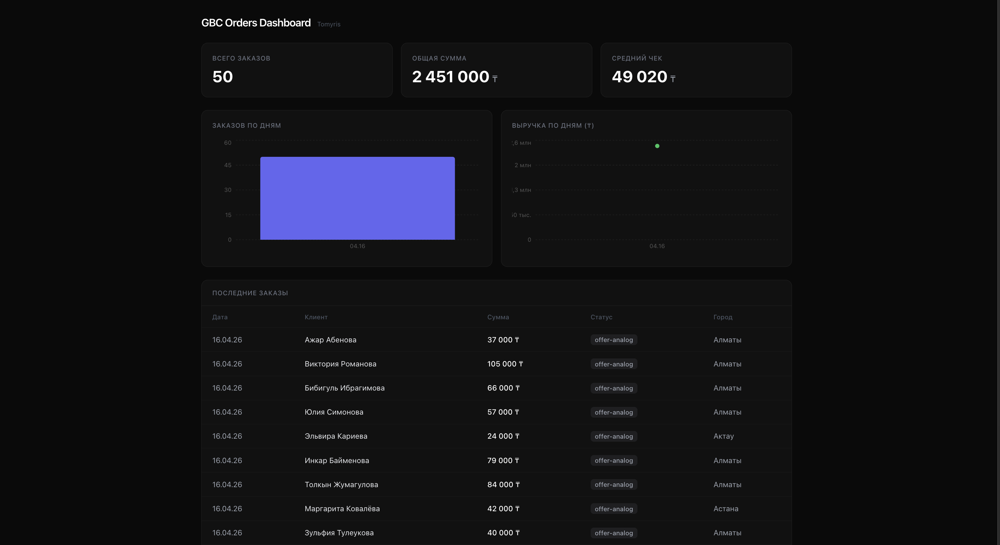
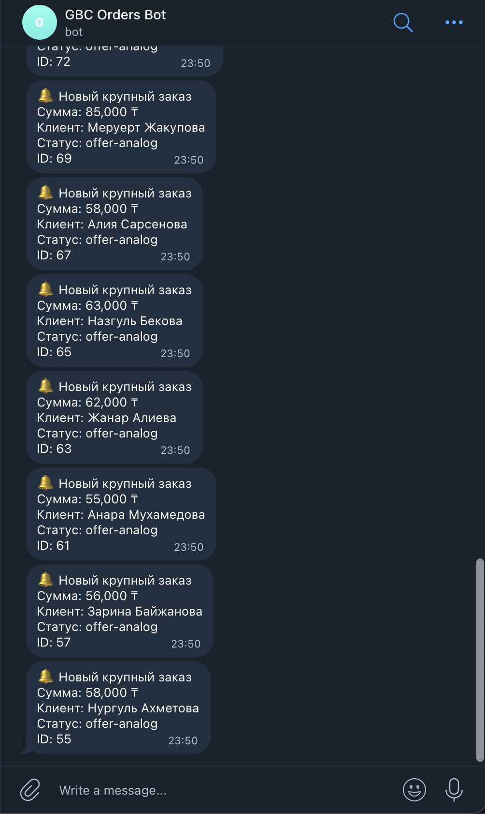
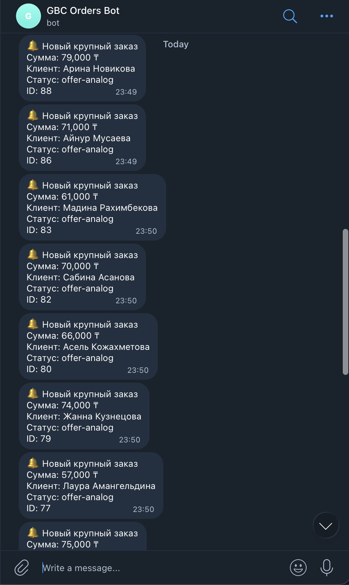

# GBC Analytics Dashboard

Решение тестового задания AI Tools Specialist.

## Ссылки
- 🌐 Дашборд: https://gbc-analytics-dashboard-orpin.vercel.app
- 📦 Репо: https://github.com/littleAvel/gbc-analytics-dashboard

## Архитектура
```
mock_orders.json → upload_to_crm.py → RetailCRM
↓
sync_to_supabase.py
├→ Supabase (upsert)
└→ Telegram Bot (если сумма > 50 000 ₸)

Next.js Dashboard ← Supabase (read via anon key + RLS)
```

## Стек
- Python 3.12, httpx, pydantic, supabase-py
- Next.js 14, TypeScript, Tailwind CSS, Recharts
- Supabase (PostgreSQL + RLS)
- RetailCRM API v5
- Telegram Bot API
- Vercel

## Как запустить локально

### Скрипты (Python)
```bash
python -m venv venv
source venv/bin/activate
pip install -r requirements.txt
cp .env.example .env.local  # заполнить ключи
python scripts/upload_to_crm.py
python scripts/sync_to_supabase.py
```

### Дашборд (Next.js)
```bash
cd dashboard
npm install
cp .env.example .env.local  # NEXT_PUBLIC_SUPABASE_URL и NEXT_PUBLIC_SUPABASE_ANON_KEY
npm run dev
```

## Тесты

```bash
source venv/bin/activate
python -m pytest tests/ -v
```

Покрытие: парсинг и валидация заказов, маппинг справочников (orderType, orderMethod, statuses), upsert-логика с обработкой дубликатов, логика Telegram-алертов (порог 50000 ₸). Все внешние API замоканы — тесты работают offline.

---
---

## Что делал Claude Code

Тестовое выполнено с использованием Claude Code CLI.

### 1. Загрузка заказов в RetailCRM
Попросила Claude Code создать скрипт загрузки с pydantic-валидацией 
и идемпотентностью через externalId. Первая версия упала на всех 50 
заказах — orderType "eshop-individual" из mock_orders не существует 
в демо-аккаунте. Проверила справочники через curl, замапила на 
существующие значения.

### 2. Идемпотентность
При повторном запуске скрипт не переходил к edit — RetailCRM 
возвращает 400 "Order already exists", а не 460 как ожидал Claude. 
Поправила условие дубликата в upsert_order().

### 3. Синхронизация RetailCRM → Supabase
Скрипт забирает заказы из CRM, делает upsert в Supabase по 
retailcrm_id, отправляет Telegram-алерт для заказов > 50000 ₸. 
Алерт отправляется только для новых записей — повторный sync 
не дублирует уведомления.

### 4. Дашборд
Next.js 14 с серверными компонентами и ISR (revalidate 60s). 
Данные читаются из Supabase через anon key + RLS policy (read-only).

Полный лог промптов: [prompts/claude_code_log.md](prompts/claude_code_log.md)


## Скриншоты

### Дашборд


### Telegram-алерт



